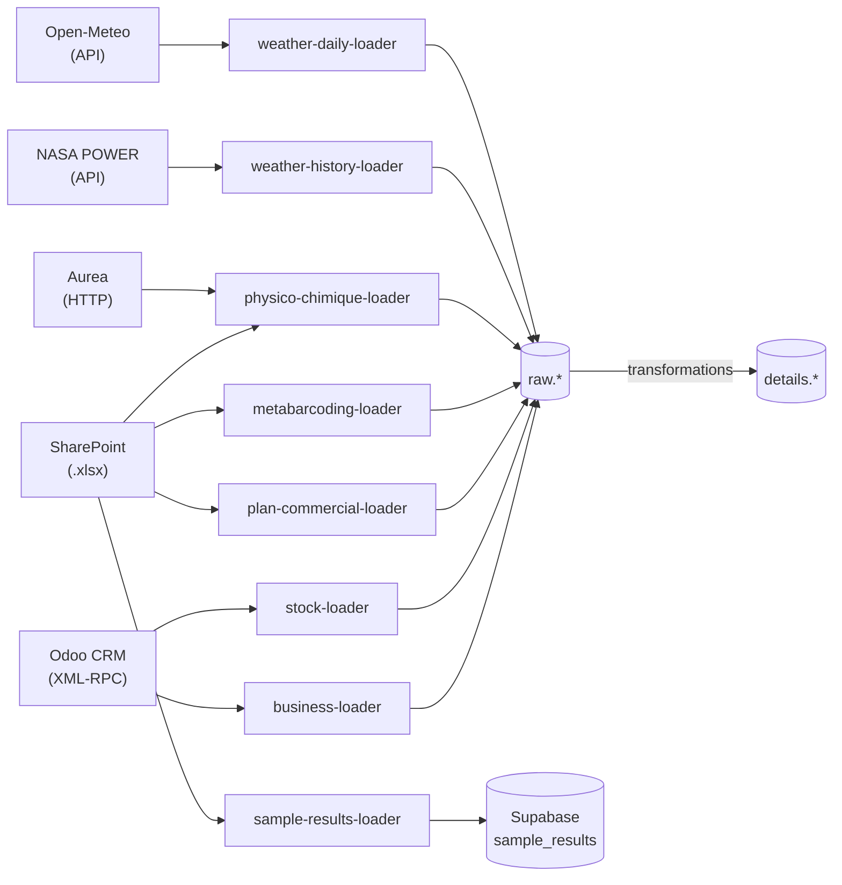

# LoadWeave

An open-source collection of Python ETL pipelines. Each loader extracts data from an external source and loads it into PostgreSQL or Supabase.

---

## Architecture



---

## Loaders

| Loader | Source | Target tables (`raw.*`) | Schedule |
|---|---|---|---|
| **business** | Odoo CRM | `opportunities`, `contacts`, `clients`, `sales`, `sale_lines`, `invoices`, `invoice_lines` | Nightly (Prefect) |
| **stock** | Odoo Stock | `products`, `stock_locations`, `stock_lots`, `stock_quants`, `stock_valuation_layers` | Nightly (Prefect) |
| **plan-commercial** | SharePoint | `sales_targets`, `sales_targets_monthly` | Manual |
| **physico-chimique** | Aurea + SharePoint | `pc_source`, `pc_echantillon`, `pc_parametre`, `pc_mesure` | Manual |
| **metabarcoding** | SharePoint (IGATech) | `metag_batch`, `metag_sample`, `metag_otu_abundance` | Manual (new batches) |
| **crm-stages** | Odoo (SSH tunnel) | `stage_changes` | Nightly (Prefect) |
| **weather-history** | NASA POWER | `weather_history` | Manual |
| **weather-daily** | Open-Meteo | `weather_daily` | Manual |
| **sample-results** | SharePoint (BDD Production CQ) | Supabase `sample_results` | Manual |

---

## Current state: raw vs details

Raw data lands in the `raw` schema. Only a subset of tables has been promoted to `details` (transformed views or tables exposed to reporting tools).

| Table | `raw` | `details` | Reporting |
|---|---|---|---|
| `opportunities` | done | done | — |
| `contacts` | done | done | — |
| `clients` | done | done | — |
| `sales` | done | pending | — |
| `sale_lines` | done | pending | — |
| `invoices` | done | pending | `fact.invoices` |
| `invoice_lines` | done | pending | `fact.invoice_lines` |
| `stock_quants` | done | pending | — |
| `stock_lots` | done | pending | — |
| `stock_valuation_layers` | done | pending | — |
| `products` | done | pending | — |
| `stock_locations` | done | pending | — |
| `commercial_plan` | done | pending | — |
| `stage_changes` | done | pending | — |
| `pc_*` (physico-chimique) | done | pending | — |
| `metag_*` (metabarcoding) | done | pending | — |
| `weather_*` | done | pending | — |

---

## Deployment — Prefect

Scheduled loaders and exports are orchestrated by Prefect. Schedules, run history and
logs are available from the Prefect interface; deployment secrets and environment
variables must be configured in Prefect.

### Scheduled runs

#### Nightly batch — Europe/Paris

```
01:00  stock-sync              -> products, locations, lots, quants, valuation
02:00  airbyte-dbt-pipeline    -> Airbyte + business loader + dbt
03:00  sample-results-sync     -> SharePoint CQ → Supabase sample_results
```

#### Weekly refresh — every Thursday at 14:30 Paris time

```
1. business-loader    -> full-refresh opportunities, contacts, clients, sales
2. crm-stage-loader   -> stage changes over the last 7 days
3. export             -> generate and upload donnees_source to SharePoint
```

#### Monthly report — last day of the month at 08:00 Paris time

```
1. business-loader    -> full-refresh
2. crm-stage-loader   -> stage changes over the last 14 days
3. export             -> generate and upload monthly reporting to SharePoint
```

### Required configuration in Prefect

The Prefect deployments must expose the following environment variables to their
flow runs (directly or through the secret-management mechanism used by the Prefect
infrastructure):

| Variable | Description |
|---|---|
| `ODOO_URL`, `ODOO_DB`, `ODOO_ADMIN_USER`, `ODOO_ADMIN_PASSWORD` | Odoo connection (admin account) |
| `DB_HOST`, `DB_PORT`, `DB_USER`, `DB_PASSWORD`, `DB_NAME` | Production PostgreSQL |
| `SHAREPOINT_TENANT_ID`, `SHAREPOINT_CLIENT_ID`, `SHAREPOINT_CLIENT_SECRET` | SharePoint |
| `SUPABASE_URL`, `SUPABASE_API_KEY` | Sample results loader (Supabase) |

---

## Running manually

```bash
# Business (Odoo)
make up SERVICE=business ENV=prod

# Plan commercial (sales pipeline)
make up SERVICE=sales-pipeline ENV=prod

# Physico-chimique
make up SERVICE=pc ENV=prod PC_PROVIDER=aurea
make up SERVICE=pc ENV=prod PC_PROVIDER=bdd_pc
make up SERVICE=pc ENV=prod PC_PROVIDER=esdac

# Metabarcoding
make run-prod-metabarcoding

# Sample results (SharePoint → Supabase)
make up SERVICE=sample-results ENV=prod

# Weather
make up SERVICE=weather-history ENV=prod
make up SERVICE=weather-daily ENV=prod
```

---

## Full documentation

See [`docs/`](docs/) — MkDocs Material site.

```bash
pip install -r docs-requirements.txt
python3 -m mkdocs serve
```
