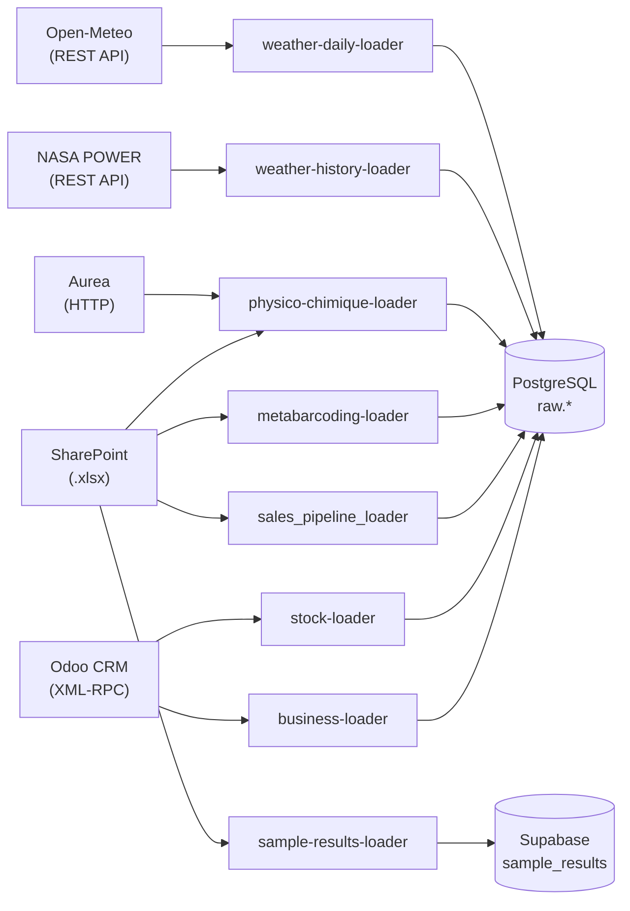

# LoadWeave

Pipelines ETL (Extract, Transform, Load) open source. Chaque loader extrait des données depuis une source externe et les charge dans PostgreSQL (schéma `raw`).

## Vue d'ensemble

## Loaders

| Loader | Source | Tables cibles | Stratégie |
|---|---|---|---|
| [Business](loaders/business.md) | Odoo CRM | `opportunities`, `contacts`, `clients`, `sales`, `sale_lines`, `invoices`, `invoice_lines` | incremental + full_replace |
| [Stock](loaders/stock.md) | Odoo Stock | `products`, `stock_locations`, `stock_lots`, `stock_quants`, `stock_valuation_layers` | full_replace |
| [Plan Commercial](loaders/plan-commercial.md) | SharePoint | `commercial_plan`, | upsert |
| [Physico-Chimique](loaders/physico-chimique.md) | Aurea + SharePoint | `pc_source`, `pc_echantillon`, `pc_parametre`, `pc_mesure` | upsert |
| [Métabarcoding](loaders/metabarcoding.md) | SharePoint (IGATech) | `metag_batch`, `metag_sample`, `metag_otu_abundance` | incremental |
| [Météo](loaders/weather.md) | NASA POWER + Open-Meteo | `weather_history`, `weather_daily` | incremental |
| [Sample Results](loaders/sample-results.md) | SharePoint (BDD Production CQ) | Supabase `sample_results` | upsert |
