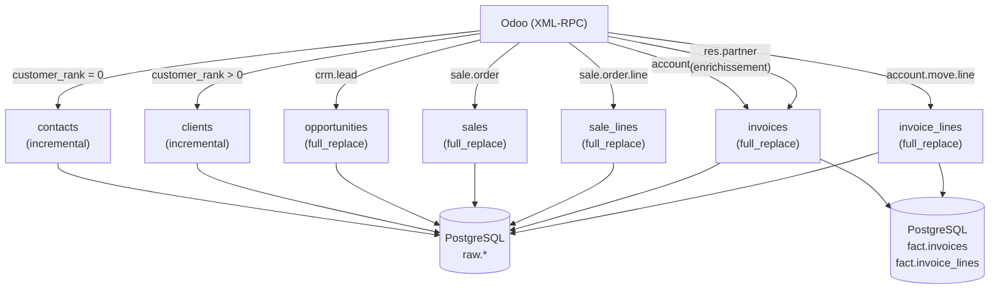

# Business Loader (Odoo)

Extrait les données CRM et commerciales depuis Odoo via XML-RPC et les charge dans PostgreSQL.

## Tables

| Table | Modèle Odoo | Domaine | Stratégie |
|---|---|---|---|
| `opportunities` | `crm.lead` | tous | `full_replace` |
| `contacts` | `res.partner` | `customer_rank = 0` | `incremental` |
| `clients` | `res.partner` | `customer_rank > 0` | `incremental` |
| `sales` | `sale.order` | tous | `full_replace` |
| `sale_lines` | `sale.order.line` | hors acomptes | `full_replace` |
| `invoices` | `account.move` | factures et avoirs clients | `full_replace` |
| `invoice_lines` | `account.move.line` | lignes produit uniquement | `full_replace` |

- **`full_replace`** — truncate + rechargement complet à chaque run
- **`incremental`** — insert uniquement des nouveaux IDs (pas de mise à jour des existants)

!!! note "contacts vs clients"
    Les deux tables tirent depuis le même modèle Odoo `res.partner`, séparés par `customer_rank` :
    - `contacts` → prospects et contacts purs (pas encore clients)
    - `clients` → partenaires ayant passé au moins une commande

## Data flow



## Champs extraits

### opportunities (`crm.lead`)

| Champ | Description |
|---|---|
| `id`, `name` | Identifiant et nom |
| `partner_id`, `user_id` | Client lié, commercial |
| `stage_id`, `priority` | Étape pipeline, priorité |
| `expected_revenue`, `probability` | Revenue estimé, probabilité |
| `date_deadline`, `date_closed`, `date_open` | Dates clés |
| `active`, `won_status` | Statut actif / gagné |
| `x_myco_bio_status` | Statut bio |
| `x_myco_contract_type` | Type de contrat |
| `x_myco_crop_type` | Type de culture |
| `x_myco_opportunity_hectares` | Superficie (ha) |
| `x_myco_sector_id` | Filière |
| `x_myco_sellsy_id` | ID Sellsy |

### contacts (`res.partner`, `customer_rank = 0`)

| Champ | Description |
|---|---|
| `id`, `firstname`, `lastname` | Identité |
| `email`, `phone`, `mobile` | Coordonnées |
| `function`, `comment` | Fonction, notes |
| `x_myco_status` | Statut |
| `x_myco_qualification_result` | Résultat qualification |
| `x_myco_urgency_level` | Niveau d'urgence |
| `x_myco_high_potential` | Haut potentiel |
| `x_myco_total_hectares` | Superficie totale (ha) |
| `x_myco_contact_source` | Source du contact |

### clients (`res.partner`, `customer_rank > 0`)

| Champ | Description |
|---|---|
| `id`, `name`, `ref` | Identité, référence interne |
| `email`, `phone`, `mobile` | Coordonnées |
| `vat`, `siret`, `company_registry` | Données légales |
| `industry_id`, `lang` | Secteur, langue |
| `x_myco_status` | Statut |
| `x_myco_naf_code`, `x_myco_rcs` | Code NAF, RCS |
| `x_myco_sellsy_id` | ID Sellsy |
| `x_myco_total_hectares` | Superficie totale (ha) |

### sales (`sale.order`)

| Champ | Description |
|---|---|
| `id`, `name` | ID, numéro de devis |
| `user_id` | Commercial |
| `partner_invoice_id`, `partner_shipping_id` | Adresse facturation, adresse livraison |
| `sale_order_template_id` | Type de contrat (ex. START) |
| `date_order`, `validity_date` | Dates commande / expiration |
| `payment_term_id`, `pricelist_id` | Conditions de paiement, tarif |
| `incoterm` | INCOTERM |
| `state` | Statut (draft, sent, sale…) |
| `opportunity_id` | Opportunité liée |
| `amount_untaxed`, `amount_tax`, `amount_total` | Montants HT, TVA, TTC |

### sale_lines (`sale.order.line`)

| Champ | Description |
|---|---|
| `id`, `order_id` | ID ligne, ID devis (FK → `sales.external_id`) |
| `order_partner_id` | Client |
| `product_id` | Produit |
| `product_uom_qty`, `product_uom` | Quantité, unité |
| `price_unit`, `discount` | Prix unitaire, remise (%) |
| `price_subtotal`, `price_total` | Montant HT, TTC |
| `tax_id` | Taxe |

### invoices (`account.move`)

| Champ | Description |
|---|---|
| `id`, `name`, `ref` | ID, numéro facture, référence |
| `partner_id` | Client facturé |
| `partner_shipping_name` | Adresse de livraison *(champ dérivé)* |
| `delivery_city` | Ville de livraison *(champ dérivé)* |
| `invoice_date`, `invoice_date_due` | Date facture, date d'échéance |
| `delivery_date` | Date de livraison |
| `currency_id`, `company_currency_id` | Devise du document et devise de reporting |
| `state` | Statut (draft, posted, cancel…) |
| `move_type` | Type de document (`out_invoice`, `out_refund`) |
| `amount_untaxed`, `amount_tax`, `amount_total` | Montants HT, TVA, TTC |
| `amount_untaxed_signed`, `amount_total_signed` | Montants signés en devise de reporting ; avoirs négatifs |
| `invoice_origin` | Numéro du devis d'origine |
| `x_myco_purchase_order_ref` | Référence bon de commande client |

### invoice_lines (`account.move.line`)

| Champ | Description |
|---|---|
| `id`, `move_id` | ID ligne, ID facture (FK → `invoices.external_id`) |
| `partner_id` | Client |
| `product_id` | Produit |
| `quantity`, `product_uom_id` | Quantité, unité |
| `price_unit`, `discount` | Prix unitaire, remise (%) |
| `price_subtotal`, `price_total` | Montant HT, TTC |
| `tax_ids` | Taxes |

## Vues de facturation Power BI

Le chargement recrée `fact.invoices` et `fact.invoice_lines`. Ces vues ne gardent
que les factures et avoirs comptabilisés, soustraient les avoirs et ajoutent les
axes pays, type de contrat et secteur provenant de l'opportunité CRM. Voir
[Suivi de la facturation dans Power BI](../powerbi_invoicing_views.md).

## Run

```bash
make up SERVICE=business ENV=prod
```
