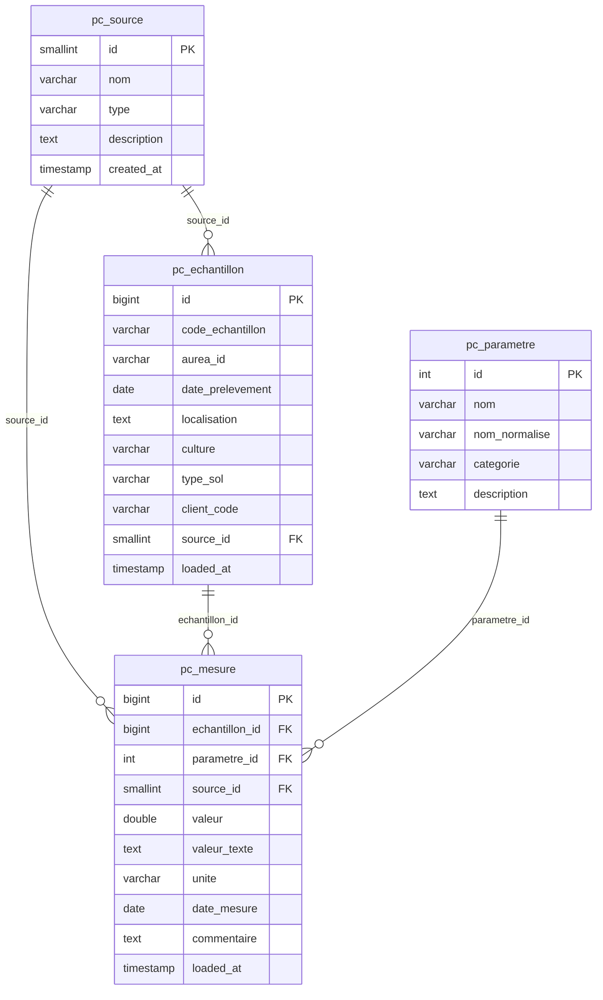
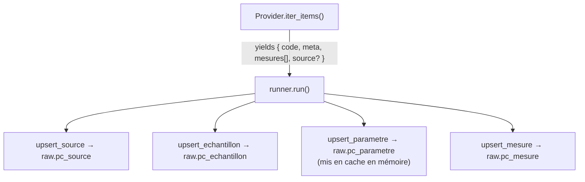

# Physico-Chimique

Charge les analyses physico-chimiques de sol depuis trois sources (Aurea, BDD_PC, ESDAC) vers PostgreSQL en architecture EAV (Entity-Attribute-Value).

## Schéma DB



## Architecture

```
loaders/pc_loader/
    main.py      → entry point — lit PC_PROVIDER, importe et exécute le bon provider
    base.py      → classe abstraite BasePCLoader
    db.py        → fonctions upsert partagées (source, echantillon, parametre, mesure)
    runner.py    → boucle générique : iter_items() → upsert DB
    providers/
        aurea.py    → portail Aurea (HTTP scraping + REST API)
        bdd_pc.py   → BDD_PC.xlsx (SharePoint)
        esdac.py    → ESDAC open data (2 fichiers Excel via SharePoint)
```

### Data flow



!!! success "Idempotent"
    Tous les upserts utilisent `ON CONFLICT DO UPDATE` — le pipeline peut être relancé à tout moment sans doublon.

## Providers

| Provider | `PC_PROVIDER` | Type | Source | Auth |
|---|---|---|---|---|
| Aurea | `aurea` | prestataire | `https://online.aurea.eu` | `AUREA_LOGIN` / `AUREA_PASSWORD` |
| BDD_PC | `bdd_pc` | interne | SharePoint `BDD_PC.xlsx` | `SHAREPOINT_*` |
| ESDAC | `esdac` | open_source | SharePoint (2 fichiers Excel) | `SHAREPOINT_*` |

### Aurea

Récupère les résultats d'analyses depuis le portail Aurea via REST paginé (10 résultats/page).

- **Auth :** cookie de session CakePHP (login POST, session maintenue)
- **Matrices chargées :** `SOL`, `ENA`, `EAV`, `MFS`, `MET`, `RAN`, `SRV`
- **Matrices exclues :** `VEG` (foliaire), `BOU`, et toute matrice non reconnue

### BDD_PC (SharePoint)

Lit `BDD_PC.xlsx` depuis SharePoint. Une ligne = un échantillon.

- **Feuille :** `Data`
- **Ligne 1 :** catégories (Texture / Chimie / Microbiologie / Autre)
- **Ligne 2 :** unités
- **Ligne 3 :** noms des colonnes
- **Ligne 4+  :** données — colonnes A→CV, 88 paramètres de mesure
- **Source :** colonne prestataire (CESAR, AUREA, TerraMea, Teyssier…) — variable par ligne

### ESDAC (open data)

Lit deux fichiers Excel depuis l'[ESDAC European Soil Database](https://esdac.jrc.ec.europa.eu), hébergés sur SharePoint :

| Fichier | Contenu | Paramètres |
|---|---|---|
| `open_soil chemical PRA_FR…xlsx` | Analyse chimique (pH, C, N, P, K, CEC…) | 10 colonnes → catégorie `Chimie` |
| `open_soil structure PRA_FR…xlsx` | Structure physique (argile, sable, limon, densité…) | 9 colonnes → catégorie `Texture` |

- **Clé échantillon :** `PRA_Code` — détectée dynamiquement depuis la ligne d'en-tête
- **Merge :** les deux fichiers sont fusionnés par PRA code avant insertion (1 item par PRA avec toutes ses mesures)

## État en production

| Source | Type | Échantillons | Mesures | Paramètres |
|---|---|---|---|---|
| esdac | open_source | 715 | 10 725 | 15 |
| aurea | prestataire | 302 | 3 632 | 47 |
| cesar | prestataire | 67 | 1 573 | 84 |
| teyssier | prestataire | 16 | 352 | 29 |
| terramea | prestataire | 12 | 336 | 28 |
| **Total** | | **1 112** | **16 618** | **116** |

## Run

```bash
make up SERVICE=pc ENV=prod PC_PROVIDER=aurea
make up SERVICE=pc ENV=prod PC_PROVIDER=bdd_pc
make up SERVICE=pc ENV=prod PC_PROVIDER=esdac
```

Ou directement via Docker Compose :

```bash
PC_PROVIDER=aurea  COMPOSE_PROFILES=pc docker-compose -f docker-compose.prod.yaml up pc-loader
PC_PROVIDER=bdd_pc COMPOSE_PROFILES=pc docker-compose -f docker-compose.prod.yaml up pc-loader
PC_PROVIDER=esdac  COMPOSE_PROFILES=pc docker-compose -f docker-compose.prod.yaml up pc-loader
```

## Ajouter un nouveau provider

1. Créer `loaders/pc_loader/providers/<name>.py` avec une classe héritant de `BasePCLoader`
2. Implémenter `iter_items()` — yield des dicts avec les clés :
    - `code` — identifiant unique de l'échantillon
    - `meta` — `aurea_id`, `date_prelevement`, `localisation`, `culture`, `type_sol`, `client_code`
    - `mesures` — liste de `{ libelle, nom_court, categorie, valeur, unite, date_mesure }`
    - `source` *(optionnel)* — `{ nom, type, description }` si la source varie par ligne
3. L'enregistrer dans `loaders/pc_loader/main.py` sous `PROVIDERS`
4. Ajouter `PC_PROVIDER=<name>` dans les env Docker Compose
