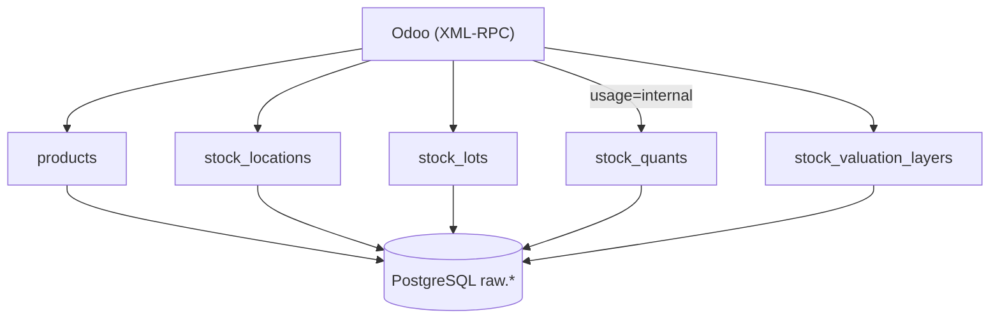

# Stock Loader (Odoo)

Extrait le stock à date, les lots et la valorisation depuis Odoo via XML-RPC
et les charge dans PostgreSQL (`raw.*`). Pas de mouvements (`stock.move`).

## Tables

| Table | Modèle Odoo | Domaine | Stratégie |
|---|---|---|---|
| `products` | `product.product` | tous | `full_replace` |
| `stock_locations` | `stock.location` | tous | `full_replace` |
| `stock_lots` | `stock.lot` | tous | `full_replace` |
| `stock_quants` | `stock.quant` | `location_id.usage = internal` | `full_replace` |
| `stock_valuation_layers` | `stock.valuation.layer` | tous | `full_replace` |

Les FK (`product_id`, `location_id`, `lot_id`, …) sont stockées en **ID Odoo**
(pas en display name) pour joindre quant ↔ lot ↔ valorisation ↔ dims.

## Data flow



## Lancer

```bash
make up SERVICE=stock ENV=dev
make up SERVICE=stock ENV=prod
```

Prefect : flow `stock-sync` (quotidien 06:00 Europe/Paris).
