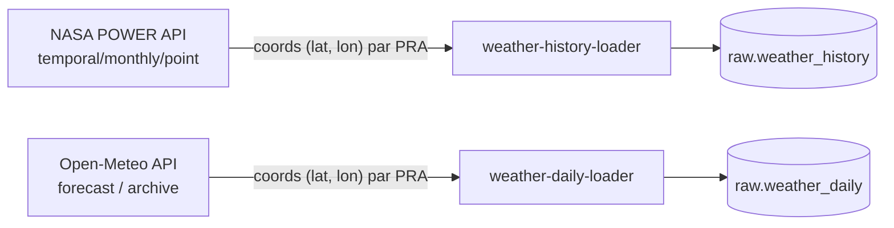

# Météo

Deux loaders distincts alimentent les données météorologiques depuis des APIs publiques.

## Sources

| Loader | API | Données | Fréquence |
|---|---|---|---|
| `weather-history` | [NASA POWER](https://power.larc.nasa.gov) | Historique mensuel | Hebdomadaire |
| `weather-daily` | [Open-Meteo](https://open-meteo.com) | Données journalières | Quotidienne |

## Data flow



## Run

=== "Production"

    ```bash
    make up SERVICE=weather-history ENV=prod
    make up SERVICE=weather-daily ENV=prod
    ```

=== "Développement"

    ```bash
    make up SERVICE=weather-history ENV=dev
    make up SERVICE=weather-daily ENV=dev
    ```
