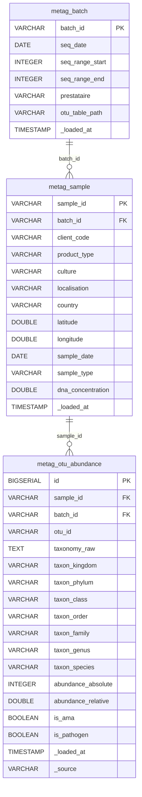
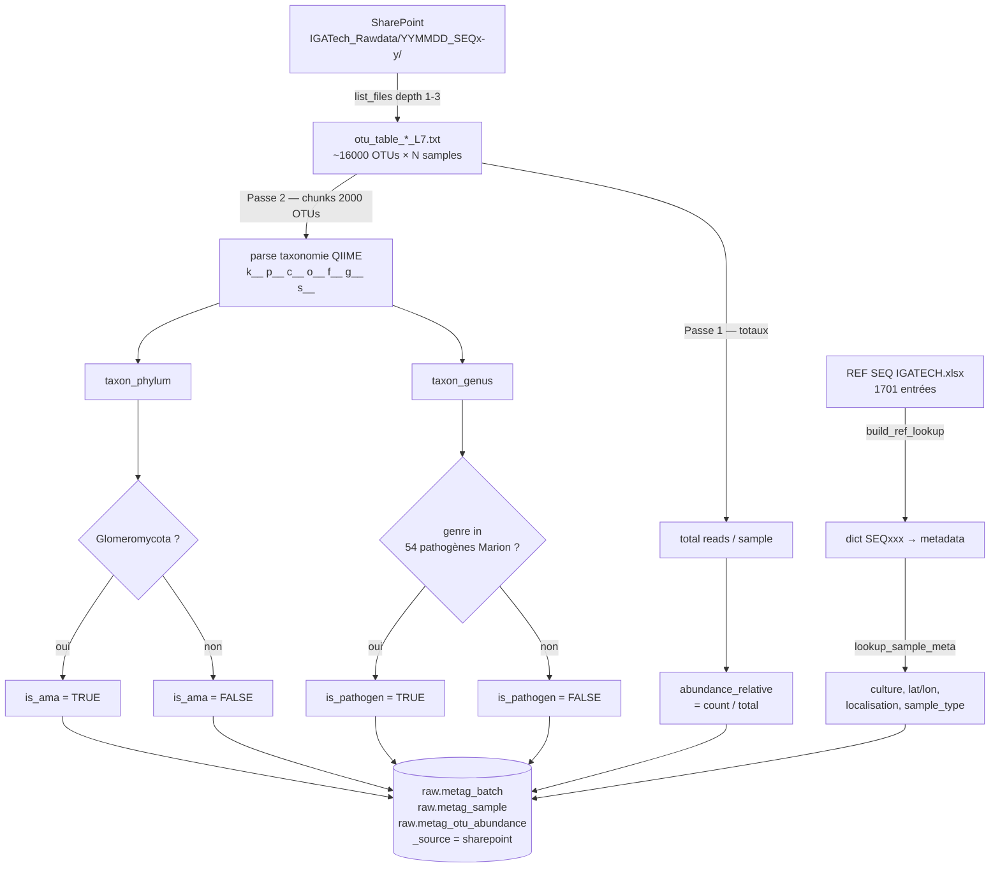
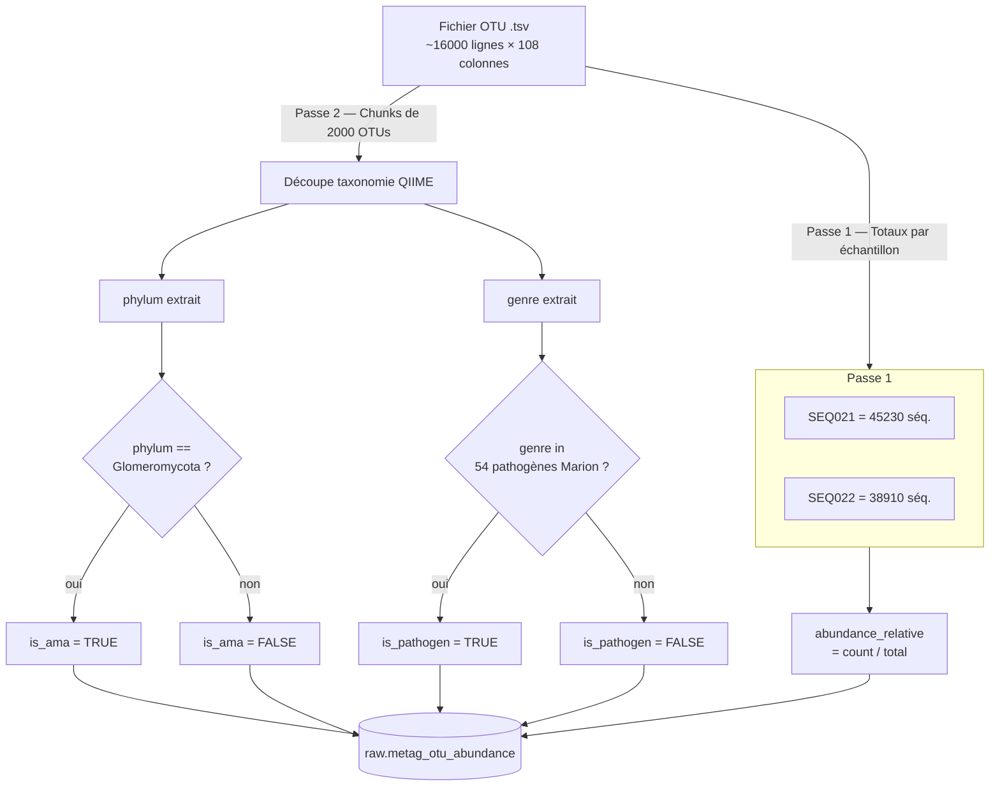
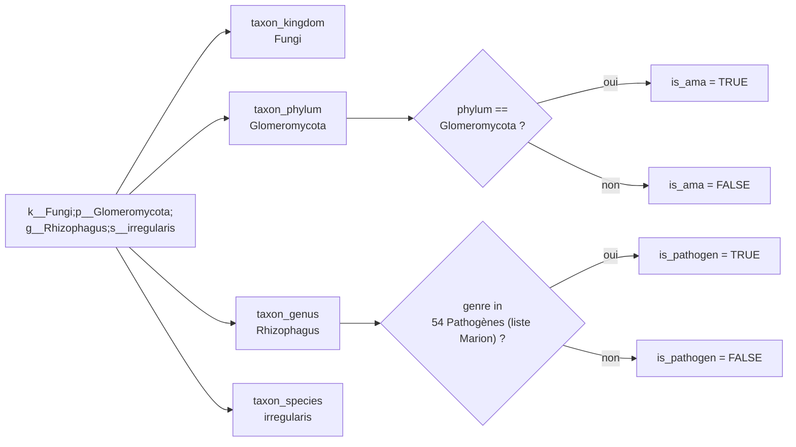

# Pipeline Métabarcoding — Diagrammes

## Schéma DB

---

## Source 1 — IGATech (batches Amplicon ITS)

**Incrémental** : `batch_already_loaded()` skip les batches déjà en base.
**16S skippés** : dossiers contenant `_16s_` / `16sonly` ignorés.

---

## Pipeline 2 passes (IGATech)

---

## Logique de classification taxonomique

