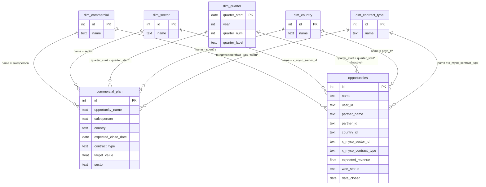
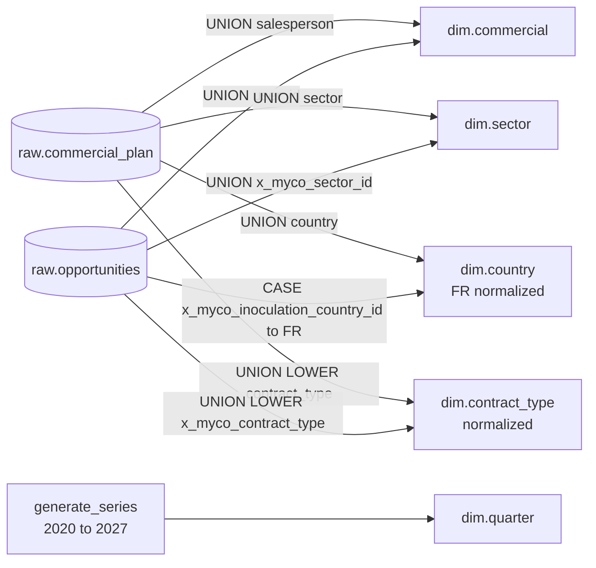
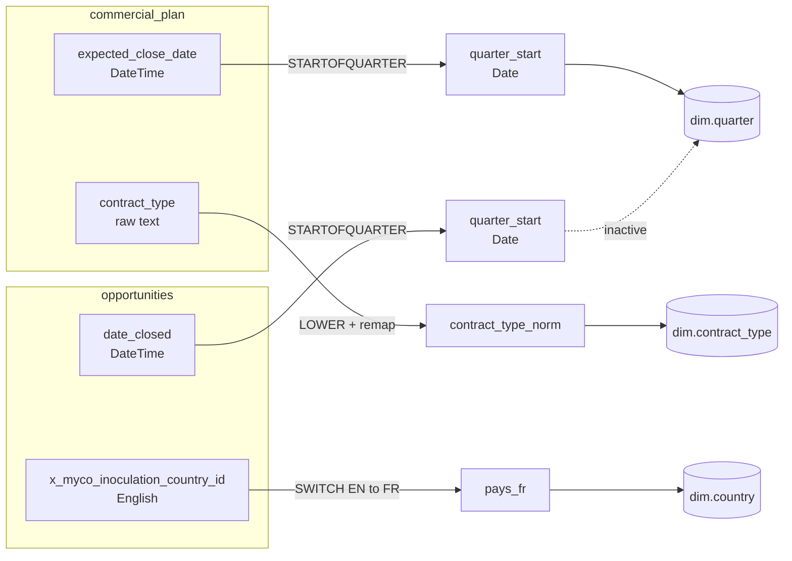
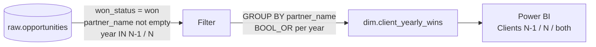

# Dimension Views — Commercial Tracking PowerBI

SQL views created in the `dim` schema to power the commercial performance tracking dashboard in Power BI.

---

## Data Model



*\* computed columns to create in Power BI — see [PBI Computed Columns](#pbi-computed-columns)*

---

## Dimension Sources



---

## dim.commercial

Distinct salespeople from the union of both fact tables.

```sql
CREATE OR REPLACE VIEW dim.commercial AS
SELECT
    ROW_NUMBER() OVER (ORDER BY name) AS id,
    name
FROM (
    SELECT DISTINCT salesperson AS name FROM raw.commercial_plan WHERE salesperson IS NOT NULL
    UNION
    SELECT DISTINCT user_id     AS name FROM raw.opportunities   WHERE user_id IS NOT NULL
) t;
```

| Column | Description |
|---|---|
| `id` | Generated identifier |
| `name` | Salesperson full name |

---

## dim.sector

Distinct sectors from the union of both fact tables.

```sql
CREATE OR REPLACE VIEW dim.sector AS
SELECT
    ROW_NUMBER() OVER (ORDER BY name) AS id,
    name
FROM (
    SELECT DISTINCT sector           AS name FROM raw.commercial_plan WHERE sector IS NOT NULL
    UNION
    SELECT DISTINCT x_myco_sector_id AS name FROM raw.opportunities   WHERE x_myco_sector_id IS NOT NULL
) t;
```

| Column | Description |
|---|---|
| `id` | Generated identifier |
| `name` | Sector name |

---

## dim.quarter

Quarter sequence from 2020 to 2027 generated via `generate_series`.

```sql
CREATE OR REPLACE VIEW dim.quarter AS
SELECT
    quarter_start,
    EXTRACT(YEAR FROM quarter_start)::int    AS year,
    EXTRACT(QUARTER FROM quarter_start)::int AS quarter_num,
    'Q' || EXTRACT(QUARTER FROM quarter_start)::int
    || ' ' || EXTRACT(YEAR FROM quarter_start)::int AS quarter_label
FROM (
    SELECT generate_series(
        DATE '2020-01-01',
        DATE_TRUNC('year', CURRENT_DATE + INTERVAL '2 years')::date,
        INTERVAL '3 months'
    )::date AS quarter_start
) t;
```

| Column | Description |
|---|---|
| `quarter_start` | First day of the quarter — join key |
| `year` | Year |
| `quarter_num` | Quarter number (1 to 4) |
| `quarter_label` | Display label in PBI (e.g. `Q2 2026`) |

> Sort `quarter_label` by `quarter_start` in PBI: **Column Tools → Sort by Column → quarter_start**

---

## dim.country

Distinct countries normalized to French, from the union of both fact tables.

```sql
CREATE OR REPLACE VIEW dim.country AS
SELECT ROW_NUMBER() OVER (ORDER BY name) AS id, name
FROM (
    SELECT DISTINCT country AS name FROM raw.commercial_plan WHERE country IS NOT NULL
    UNION
    SELECT DISTINCT CASE x_myco_inoculation_country_id
        WHEN 'Belgium'       THEN 'Belgique'
        WHEN 'Morocco'       THEN 'Maroc'
        WHEN 'Netherlands'   THEN 'Pays-Bas'
        WHEN 'Poland'        THEN 'Pologne'
        WHEN 'Romania'       THEN 'Roumanie'
        WHEN 'Spain'         THEN 'Espagne'
        WHEN 'Switzerland'   THEN 'Suisse'
        WHEN 'Ireland'       THEN 'Irlande'
        WHEN 'Senegal'       THEN 'Sénégal'
        WHEN 'United States' THEN 'États-Unis'
        ELSE x_myco_inoculation_country_id
    END FROM raw.opportunities WHERE x_myco_inoculation_country_id IS NOT NULL
) t;
```

| Column | Description |
|---|---|
| `id` | Generated identifier |
| `name` | Country name in French |

---

## dim.contract_type

Contract types normalized to lowercase with `pulse_upsell` unified across both sources.

```sql
CREATE OR REPLACE VIEW dim.contract_type AS
SELECT ROW_NUMBER() OVER (ORDER BY name) AS id, name
FROM (
    SELECT DISTINCT
        CASE LOWER(contract_type)
            WHEN 'pulse - upsell' THEN 'pulse_upsell'
            ELSE LOWER(contract_type)
        END AS name
    FROM raw.commercial_plan WHERE contract_type IS NOT NULL
    UNION
    SELECT DISTINCT LOWER(x_myco_contract_type)
    FROM raw.opportunities WHERE x_myco_contract_type IS NOT NULL
) t;
```

| Column | Description |
|---|---|
| `id` | Generated identifier |
| `name` | Normalized type: audit, flow, pulse, pulse_upsell, ready, start |

---

## PBI Computed Columns

Computed columns to create in Power BI on both fact tables to activate dimension relationships.



**On `raw.commercial_plan`:**

```dax
quarter_start =
VAR d = commercial_plan[expected_close_date]
RETURN DATE(YEAR(d), IF(MONTH(d)<=3,1, IF(MONTH(d)<=6,4, IF(MONTH(d)<=9,7,10))), 1)

contract_type_norm =
VAR raw = LOWER(commercial_plan[contract_type])
RETURN IF(raw = "pulse - upsell", "pulse_upsell", raw)
```

**On `raw.opportunities`:**

```dax
quarter_start =
VAR d = opportunities[date_closed]
RETURN DATE(YEAR(d), IF(MONTH(d)<=3,1, IF(MONTH(d)<=6,4, IF(MONTH(d)<=9,7,10))), 1)

pays_fr =
SWITCH(
    opportunities[x_myco_inoculation_country_id],
    "Belgium",       "Belgique",
    "Morocco",       "Maroc",
    "Netherlands",   "Pays-Bas",
    "Poland",        "Pologne",
    "Romania",       "Roumanie",
    "Spain",         "Espagne",
    "Switzerland",   "Suisse",
    "Ireland",       "Irlande",
    "Senegal",       "Sénégal",
    "United States", "États-Unis",
    opportunities[x_myco_inoculation_country_id]
)
```

---

## dim.client_yearly_wins

Per-client boolean flags indicating whether the client won a deal in the previous year (N-1) and/or the current year (N). Used to avoid complex DAX intersection logic.



```sql
CREATE OR REPLACE VIEW dim.client_yearly_wins AS
SELECT
    partner_name,
    BOOL_OR(EXTRACT(YEAR FROM date_closed) <= EXTRACT(YEAR FROM CURRENT_DATE) - 1) AS won_before_n1,
    BOOL_OR(EXTRACT(YEAR FROM date_closed) = EXTRACT(YEAR FROM CURRENT_DATE) - 1)  AS won_n1,
    BOOL_OR(EXTRACT(YEAR FROM date_closed) = EXTRACT(YEAR FROM CURRENT_DATE))      AS won_n
FROM raw.opportunities
WHERE won_status = 'won'
  AND partner_name IS NOT NULL
  AND partner_name != ''
GROUP BY partner_name;
```

| Column | Description |
|---|---|
| `partner_name` | Client name — one row per distinct client |
| `won_before_n1` | `TRUE` if the client won at least one deal before year N-1 |
| `won_n1` | `TRUE` if the client won at least one deal in year N-1 |
| `won_n` | `TRUE` if the client won at least one deal in year N |

> `CURRENT_DATE` makes the view year-agnostic — it automatically shifts to the new year without any code change.

> Empty strings in `partner_name` are explicitly excluded (`!= ''`) to avoid counting blank Odoo records as a client.

---

## DAX Measures

```dax
Objectif =
SUM(commercial_plan[target_value])

Gagné =
CALCULATE(
    SUM(opportunities[expected_revenue]),
    opportunities[won_status] = "won",
    USERELATIONSHIP(dim.quarter[quarter_start], opportunities[quarter_start])
)

% Atteinte =
DIVIDE([Gagné], [Objectif])

Objectif cumulé =
CALCULATE(
    [Objectif],
    FILTER(ALL(dim.quarter), dim.quarter[quarter_start] <= MAX(dim.quarter[quarter_start]))
)

Gagné cumulé =
CALCULATE(
    [Gagné],
    FILTER(ALL(dim.quarter), dim.quarter[quarter_start] <= MAX(dim.quarter[quarter_start]))
)

% Atteinte cumulé =
DIVIDE([Gagné cumulé], [Objectif cumulé])

Clients gagnés N-1 et N =
CALCULATE(
    DISTINCTCOUNT(opportunities[partner_name]),
    opportunities[won_status] = "won",
    YEAR(opportunities[date_closed]) = YEAR(TODAY()),
    FILTER(
        VALUES(opportunities[partner_name]),
        CALCULATE(
            COUNTROWS(opportunities),
            opportunities[won_status] = "won",
            YEAR(opportunities[date_closed]) = YEAR(TODAY()) - 1
        ) > 0
    )
)
```

### Client retention measures (using dim.client_yearly_wins)

Simpler alternative using the pre-aggregated view — preferred over the DAX intersection approach above.

```dax
Clients N-1 =
COUNTROWS(FILTER(client_yearly_wins, client_yearly_wins[won_n1] = TRUE))

Clients N =
COUNTROWS(FILTER(client_yearly_wins, client_yearly_wins[won_n] = TRUE))

Clients N-1 et N =
COUNTROWS(FILTER(client_yearly_wins, client_yearly_wins[won_n1] = TRUE && client_yearly_wins[won_n] = TRUE))

Clients avant N-1 =
COUNTROWS(FILTER(client_yearly_wins, client_yearly_wins[won_before_n1] = TRUE))

Clients avant N-1 et N =
COUNTROWS(FILTER(client_yearly_wins, client_yearly_wins[won_before_n1] = TRUE && client_yearly_wins[won_n] = TRUE))
```
