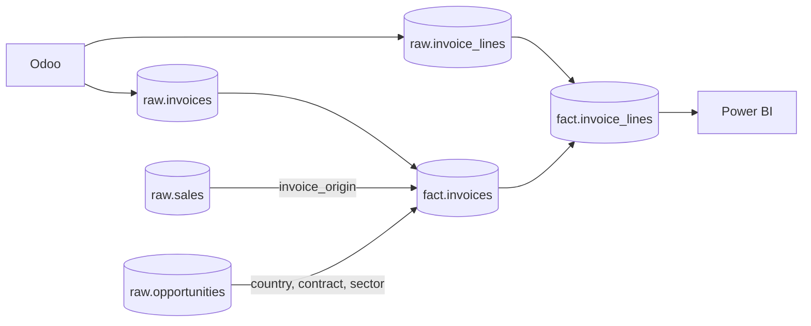

# Invoicing Tracking in Power BI

This model exposes PostgreSQL views designed to track invoiced amounts by
quarter, country, contract type, and sector. Accounting rules are applied
directly in the database to prevent Power BI from accidentally including
a draft or cancelled document, or counting a credit note in the wrong direction.

## Business Rules

- Only Odoo documents with `state = 'posted'` are included.
- Customer invoices (`out_invoice`) are positive.
- Customer credit notes (`out_refund`) are negative.
- Reporting amounts use the Odoo company currency through
  `amount_untaxed_signed` and `amount_total_signed`.
- Country refers to the lead country, following the business decision made on
  July 30, 2026. The inoculation country is not used because it was populated
  for only 11 of the 60 invoices during the initial data review.
- Contract type and sector come from the CRM opportunity linked to the quote.
  `sale_order_template_id` is not used because it was most often set to the
  `Sans offre` placeholder on invoiced quotations during the initial review.
- An invoice without a CRM link remains included in the totals under
  `Not provided`.

This last rule is essential: missing opportunity data must never remove actual
invoiced revenue from the report.

## Data Model



### `fact.invoices`

One row per posted invoice or posted credit note. Use this view for
document-level controls and indicators.

Main columns:

| Column                                           | Description                                            |
| ------------------------------------------------ | ------------------------------------------------------ |
| `invoice_id`, `invoice_number`                   | Odoo identifier and document number                    |
| `invoice_date`, `quarter_start`, `quarter_label` | Time dimensions                                        |
| `document_type`                                  | `Invoice` or `Credit Note`                             |
| `amount_untaxed`, `amount_tax`, `amount_total`   | Signed net, tax, and gross amounts                     |
| `country`, `contract_type`, `sector`             | Dimensions inherited from the CRM opportunity          |
| `crm_link_status`                                | Quality of the invoice → quotation → opportunity chain |

Possible `crm_link_status` values:

| Status                  | Meaning                                                  |
| ----------------------- | -------------------------------------------------------- |
| `linked`                | The invoice is linked to a CRM opportunity               |
| `missing_origin`        | The invoice was created without an originating quotation |
| `sale_not_found`        | The origin reference is missing from `raw.sales`         |
| `ambiguous_origin`      | Multiple quotations share the same number                |
| `missing_opportunity`   | The quotation is not linked to an opportunity            |
| `opportunity_not_found` | The opportunity ID is missing from the CRM extract       |

### `fact.invoice_lines`

One row per invoiced product. This is the recommended primary table in
Power BI: quarter, offer, country, contract type, and sector are all
available on the same row. Line amounts are converted into the reporting
currency and reconciled with the invoice header.

### Backward Compatibility

`dim.offer` and `dim.invoice_link` remain available for existing reports.
`dim.invoice_link` now contains every invoice, including those without a CRM
link, and exposes their `link_status`. New reports should use the `fact.*`
views.

## Odoo Data Validation

Read-only validation performed on August 5, 2026:

| Check                            |         Result |
| -------------------------------- | -------------: |
| Extracted documents              |             61 |
| Posted customer invoices         |             28 |
| Posted customer credit notes     |              1 |
| Excluded drafts                  |             31 |
| Excluded cancelled documents     |              1 |
| Posted net amount excluding tax  | EUR 162,991.52 |
| Posted net amount including tax  | EUR 183,804.59 |
| Posted product lines             |            115 |
| Header-to-line difference        |       EUR 0.00 |
| Posted documents with a CRM link |        21 / 29 |

## Refresh

The new fields must be loaded from Odoo once before the `fact.*` views become
available:

```bash
make up SERVICE=business ENV=prod
```

Afterwards, the weekly Prefect deployment refreshes the data every Thursday
at 14:30 Paris time. After each load, the process compares invoice header
totals with line totals and writes a warning to the logs if they do not
reconcile.
