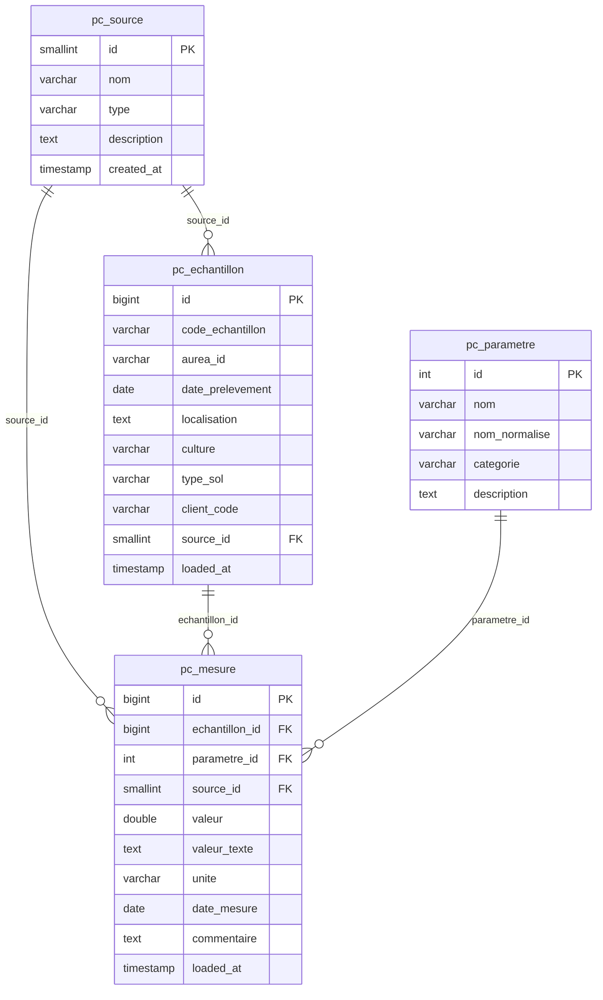

# Physico-Chemical Pipeline

## Database Schema



## Architecture

```
loaders/pc_loader/
    main.py            → entry point — reads PC_PROVIDER, imports and runs the right provider
    base.py            → BasePCLoader abstract class
    db.py              → shared upsert functions (source, echantillon, parametre, mesure)
    runner.py          → generic loop: iter_items() → upsert to DB
    providers/
        aurea.py       → Aurea portal (HTTP scraping + REST API)
        bdd_pc.py      → BDD_PC.xlsx (SharePoint)
        esdac.py       → ESDAC open data (2 Excel files via SharePoint)
```

### Data flow

```
Provider.iter_items()
    └── yields { code, meta, mesures[], source? }
            │
            ▼
        runner.run()
            ├── upsert_source       → raw.pc_source
            ├── upsert_echantillon  → raw.pc_echantillon
            ├── upsert_parametre    → raw.pc_parametre (cached in memory)
            └── upsert_mesure       → raw.pc_mesure
```

All upserts use `ON CONFLICT DO UPDATE` — the pipeline is fully idempotent and can be re-run safely at any time.

## Providers

| Provider | `PC_PROVIDER` | Type | Source | Auth |
|---|---|---|---|---|
| Aurea | `aurea` | prestataire | `https://online.aurea.eu` | `AUREA_LOGIN` / `AUREA_PASSWORD` |
| BDD_PC | `bdd_pc` | interne | SharePoint `BDD_PC.xlsx` | `SHAREPOINT_*` env vars |
| ESDAC | `esdac` | open_source | SharePoint (2 Excel files) | `SHAREPOINT_*` env vars |

### Aurea

Fetches physico-chemical analysis results from the Aurea portal via REST pagination (10 results/page).

- **Auth:** CakePHP session cookie (login via POST, then session maintained)
- **Loaded matrices:** `SOL`, `ENA`, `EAV`, `MFS`, `MET`, `RAN`, `SRV`
- **Excluded matrices:** `VEG` (foliar), `BOU`, and any unrecognised matrix
- **Source per item:** always `aurea` (single source)
- **Prod counts:** ~302 échantillons, ~3 632 mesures, 47 paramètres

### BDD_PC (SharePoint)

Reads `BDD_PC.xlsx` from SharePoint. One row = one sample.

- **Sheet:** `Data`
- **Row 1:** categories (Texture / Chimie / Microbiologie / Autre)
- **Row 2:** units
- **Row 3:** column names
- **Row 4+:** data rows — columns A→CV, 88 measure parameters
- **Source per item:** prestataire column (CESAR, AUREA, TerraMea, Teyssier…) — each row can have a different lab as source
- **Deduplication:** rows with the same `(code_echantillon, prestataire)` are detected and skipped with a WARNING log
- **Skipped rows:** rows where code or prestataire is empty or starts with `#`
- **Prod counts:** 97 échantillons across 4 prestataires (cesar: 67, teyssier: 16, terramea: 12, aurea: 2+), ~3 834 mesures

### ESDAC (open data)

Reads two Excel files hosted on SharePoint from the [ESDAC European Soil Database](https://esdac.jrc.ec.europa.eu):

| File | Content | Parameters |
|---|---|---|
| `open_soil chemical PRA_FR…xlsx` | Chemical analysis (pH, C, N, P, K, CEC…) | 10 columns → categorie `Chimie` |
| `open_soil structure PRA_FR…xlsx` | Physical structure (clay, sand, silt, bulk density…) | 9 columns → categorie `Texture` |

- **Sample key:** `PRA_Code` — detected dynamically from header row
- **Merge:** both files are merged per PRA code before yielding (one item per PRA with all measures combined)
- **Coordinates:** longitude + latitude stored in `localisation` field as `"lat,lon"`
- **Source:** single source `esdac` for all rows
- **Prod counts:** 715 échantillons, 10 725 mesures, 15 paramètres

## Running

```bash
# Production
PC_PROVIDER=aurea  COMPOSE_PROFILES=pc docker-compose -f docker-compose.prod.yaml up pc-loader
PC_PROVIDER=bdd_pc COMPOSE_PROFILES=pc docker-compose -f docker-compose.prod.yaml up pc-loader
PC_PROVIDER=esdac  COMPOSE_PROFILES=pc docker-compose -f docker-compose.prod.yaml up pc-loader

# Local (dev)
PC_PROVIDER=aurea  COMPOSE_PROFILES=pc docker-compose up pc-loader
PC_PROVIDER=bdd_pc COMPOSE_PROFILES=pc docker-compose up pc-loader
PC_PROVIDER=esdac  COMPOSE_PROFILES=pc docker-compose up pc-loader

# Direct (no Docker)
PC_PROVIDER=aurea  python -m loaders.pc_loader.main
PC_PROVIDER=bdd_pc python -m loaders.pc_loader.main
PC_PROVIDER=esdac  python -m loaders.pc_loader.main
```

## Production state (as of 2026-04-21)

| Source | Type | Échantillons | Mesures | Paramètres |
|---|---|---|---|---|
| esdac | open_source | 715 | 10 725 | 15 |
| aurea | prestataire | 302 | 3 632 | 47 |
| cesar | prestataire | 67 | 1 573 | 84 |
| teyssier | prestataire | 16 | 352 | 29 |
| terramea | prestataire | 12 | 336 | 28 |
| **Total** | | **1 112** | **16 618** | **116** |

## Adding a New Provider

1. Create `loaders/pc_loader/providers/<name>.py` with a class extending `BasePCLoader`
2. Implement `iter_items()` — yield dicts with keys:
   - `code` — unique sample identifier (string)
   - `meta` — dict with `aurea_id`, `date_prelevement`, `localisation`, `culture`, `type_sol`, `client_code`
   - `mesures` — list of `{ libelle, nom_court, categorie, valeur, unite, date_mesure }`
   - `source` *(optional)* — dict with `nom`, `type`, `description` (use when source differs per row)
3. Register it in `loaders/pc_loader/main.py` under `PROVIDERS`
4. Add `PC_PROVIDER=<name>` to docker-compose env and run
