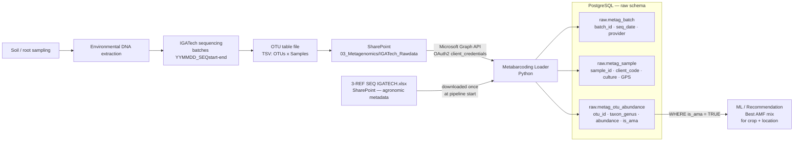
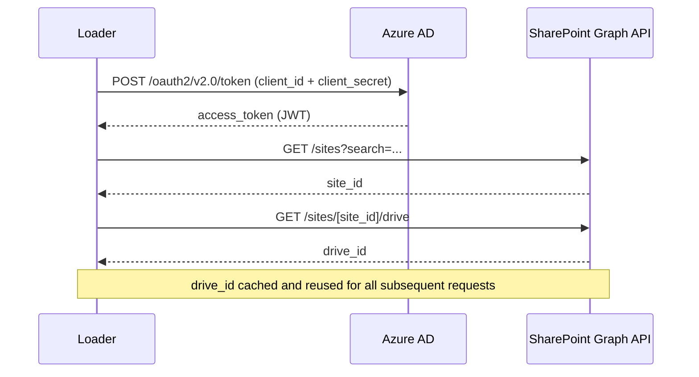
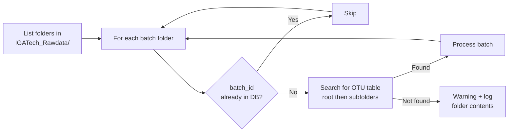
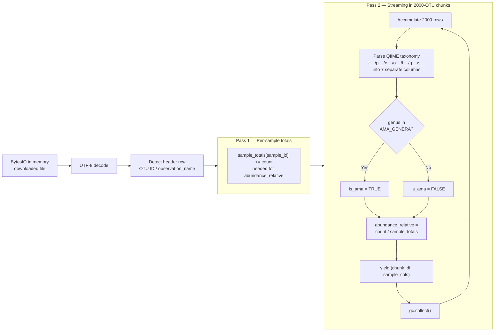
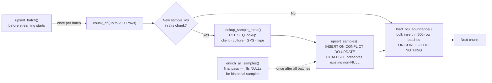
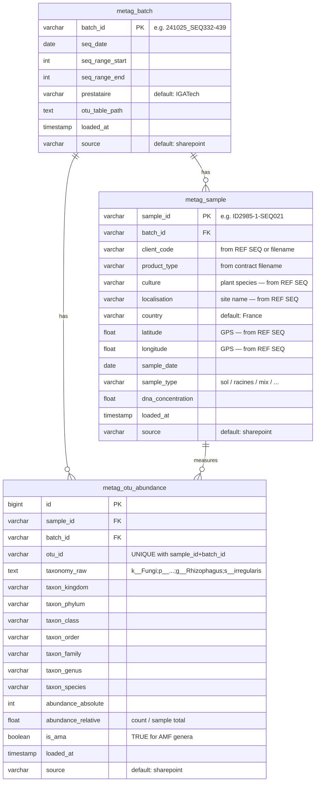

# Metabarcoding Loader

Automatically loads fungal sequencing data (OTU tables) from SharePoint into PostgreSQL.

---

## Biological Background

**Metabarcoding** is an environmental DNA analysis technique:

1. Soil or root samples are collected in the field
2. DNA is extracted from all organisms present (fungi, bacteria, etc.)
3. A sequencing provider (IGATech) sequences these DNA fragments
4. An algorithm clusters similar sequences into **OTUs** (Operational Taxonomic Units) — each OTU represents a species or a group of closely related species
5. Each OTU is annotated taxonomically: kingdom → phylum → class → order → family → genus → species

This loader focuses on **AMF** (Arbuscular Mycorrhizal Fungi / Glomeromycota), which colonise plant roots and enhance their nutrition.

---

## Pipeline Overview



---

## File Structure

```
metabarcoding_loader/
├── main.py              # Entry point — full orchestration
├── tsv_parser.py        # Streaming OTU table parser (two-pass)
├── metadata_parser.py   # Extract batch_id, client, product from filenames
├── db_loader.py         # PostgreSQL upserts (batch, samples, OTU abundances)
├── ref_seq_enricher.py  # REF SEQ IGATECH metadata enrichment (culture, GPS, sample_type)
└── README.md            # This file
```

---

## Step-by-Step Walkthrough

### Step 1 — SharePoint Authentication



Credentials come from `.env.prod`: `SHAREPOINT_TENANT_ID`, `SHAREPOINT_CLIENT_ID`, `SHAREPOINT_CLIENT_SECRET`, `SHAREPOINT_SITE_URL`.

The HTTP session uses a **retry policy** (5 attempts, backoff 1→16 s) covering network errors and 429/5xx responses.

---

### Step 2 — Incremental Batch Discovery



**Batch ID naming** (`metadata_parser.py`):

| SharePoint folder | Generated batch_id |
|---|---|
| `241025_SEQ332-439` | `241025_SEQ332-439` |
| `250812_SEQ1175-SEQ1277_...` | `250812_SEQ1175-SEQ1277_...` |
| `raw data to sort — potential duplicate` | `MISC_raw_data_to_sort_potential_duplicate` |

Folders that do not match the `YYMMDD_SEQx-y` pattern receive a `MISC_` prefix with spaces and accents cleaned.

**OTU file priority** within a folder:
1. `otu_table_sample-metadata_no-singletons_L7.txt` (species level — most precise)
2. `otu_table_sample-metadata_no-singletons_L6.txt` (genus level)
3. `otu_table.tsv` (generic format)
4. Any file starting with `otu_table` and ending with `.tsv` or `.txt`

The search goes two levels deep into subfolders (e.g. `results/`, `summary_ITS_analysis/otu_tables/`) before giving up.
Non-ITS batches (name contains `16Sonly`, `_16S_`) are skipped entirely — no fungal data expected.

---

### Step 3 — Streaming OTU Table Parser

OTU files can be several tens of MB (e.g. 24 MB for 16,000 OTUs × 108 samples). A naive full-load would trigger an OOM kill. The parser uses a **two-pass streaming strategy**:



**AMF genera flagged** (`is_ama = TRUE`):
`Rhizophagus`, `Glomus`, `Funneliformis`, `Diversispora`, `Claroideoglomus`, `Acaulospora`, `Gigaspora`, `Scutellospora`, `Archaeospora`, `Paraglomus`, `Ambispora`, `Dentiscutata`, `Redeckera`, `Septoglomus`, `Racocetra`, `Pacispora`

**Chunk DataFrame columns:**

| Column | Type | Example |
|---|---|---|
| `otu_id` | str | `OTU_001` |
| `sample_id` | str | `MYC2024_001` |
| `taxonomy_raw` | str | `k__Fungi;p__Glomeromycota;…;g__Rhizophagus;s__irregularis` |
| `taxon_kingdom` | str | `Fungi` |
| `taxon_phylum` | str | `Glomeromycota` |
| `taxon_class` | str | `Glomeromycetes` |
| `taxon_order` | str | `Glomerales` |
| `taxon_family` | str | `Glomeraceae` |
| `taxon_genus` | str | `Rhizophagus` |
| `taxon_species` | str | `irregularis` |
| `abundance_absolute` | int | `1247` |
| `abundance_relative` | float | `0.034521` |
| `is_ama` | bool | `True` |

---

### Step 4 — Database Loading



**Conflict policy per table:**

| Table | On conflict | Effect |
|---|---|---|
| `metag_batch` | `DO UPDATE` | Updates OTU table path if batch reloaded |
| `metag_sample` | `COALESCE DO UPDATE` | Never overwrites a non-NULL value with NULL |
| `metag_otu_abundance` | `DO NOTHING` | Duplicate `(sample_id, batch_id, otu_id)` silently ignored |

---

## PostgreSQL Tables (`raw` schema)



---

## Running the Loader

```bash
# Apply migrations (once)
make init-prod-db

# Run incremental load
make run-prod-metabarcoding

# Debug: inspect folder contents when no OTU table is found
LOG_LEVEL=DEBUG make run-prod-metabarcoding 2>&1 | grep -E "(DEBUG|WARNING.*No OTU)"
```

---

## Environment Variables (`.env.prod`)

| Variable | Description |
|---|---|
| `SHAREPOINT_TENANT_ID` | Azure AD tenant ID |
| `SHAREPOINT_CLIENT_ID` | Azure app client ID |
| `SHAREPOINT_CLIENT_SECRET` | Azure app client secret |
| `SHAREPOINT_SITE_URL` | SharePoint site URL |
| `DB_USER` | PostgreSQL user |
| `DB_PASSWORD` | PostgreSQL password |
| `DB_HOST` | PostgreSQL host |
| `DB_PORT` | PostgreSQL port (default 5432) |
| `DB_NAME` | Database name |
| `LOG_LEVEL` | Log level (`INFO` by default, `DEBUG` for diagnostics) |

---

## REF SEQ Enrichment

At pipeline start, `ref_seq_enricher.py` downloads `3-REF SEQ IGATECH.xlsx` from SharePoint and builds an in-memory lookup `{SEQ_ref → metadata}` (1700+ entries).

**Join key:** `sample_id` (e.g. `ID2985-1-SEQ021`) → extract `SEQ021` via regex `SEQ-?(\d+)` → normalize to `SEQ021` / `SEQ1175`.

Fields populated from REF SEQ:

| Field | Source |
|---|---|
| `client_code` | "Code client / projet" column |
| `culture` | "Plante" column |
| `sample_type` | "Type" column (sol / racines / mix / …) |
| `latitude` / `longitude` | "Latitude_deci" / "Longitude_deci" columns |
| `localisation` | "Commentaire" column |

Enrichment runs at two moments:
1. **Inline** during batch processing — new samples get metadata immediately
2. **Final pass** via `enrich_all_samples()` — fills NULLs for historical samples already in DB

All updates use `COALESCE` — an existing non-NULL value is never overwritten.
